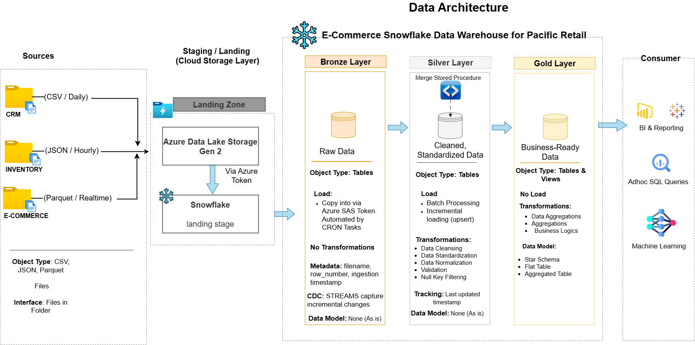

# Pacific Retail — Modern Data Platform (Azure + Snowflake Medallion Architecture)




## Overview

Pacific Retail is a multinational retail company operating across 15 countries in North America and Europe, with 1,000+ active customers, 1,000 products, and a growing transaction volume processed daily. The business faced a critical data infrastructure problem: customer data, product catalogues, and transaction records lived in separate systems with no unified view, batch processing created 24-hour delays in sales reporting, and data quality inconsistencies across countries made cross-channel reporting unreliable.

This project builds a modern, cloud-native data platform on **Azure Data Lake Storage Gen2** and **Snowflake** using a **medallion architecture (Bronze → Silver → Gold)** — consolidating fragmented data sources into a single source of truth, reducing processing latency from 24 hours to near real-time, and laying the foundation for self-service analytics and future ML initiatives.

---

## Business Problems Solved

| Problem | Impact | Solution |
|---|---|---|
| Data silos across CRM, inventory, and e-commerce systems | No holistic view of business performance | Centralised ingestion into unified Snowflake platform |
| 24-hour batch processing delay | Sales reporting too slow for operational decisions | Incremental stream-based processing with scheduled tasks |
| Inconsistent data formats across 15 countries | Reporting errors, unreliable cross-channel metrics | Standardisation and validation rules enforced in Silver layer |
| Infrastructure unable to scale during peak sales | System degradation at high volume | Snowflake's elastic compute separates storage and processing |
| No foundation for advanced analytics or ML | Cannot support demand forecasting or personalised marketing | Gold layer structured as dimensional model ready for BI and ML consumption |

---

## Architecture

```
Data Sources
    │
    ├── CRM System          → Customer data (CSV, daily)
    ├── Inventory System    → Product catalogue (JSON, hourly)
    └── E-commerce Platform → Transaction logs (Parquet, real-time)
    │
    ▼
Azure Data Lake Storage Gen2 (Landing Zone)
    │   Raw files stored by source and date partition
    │   Acts as cost-effective staging before Snowflake ingestion
    │
    ▼
Snowflake — pacificretail_db
    │
    ├── BRONZE Schema (Raw Ingestion)
    │   ├── COPY INTO from ADLS via Azure SAS token
    │   ├── Source metadata captured (filename, row number, ingestion timestamp)
    │   ├── Scheduled TASKS automate loading (CRON-based)
    │   └── STREAMS capture incremental changes for downstream processing
    │
    ├── SILVER Schema (Cleansed & Conformed)
    │   ├── MERGE-based stored procedures process stream changes
    │   ├── Data quality rules enforced at ingestion:
    │   │     • Customer type standardisation (Regular / Premium / Unknown)
    │   │     • Gender normalisation (Male / Female / Other)
    │   │     • Age validation (18–120, null if outside range)
    │   │     • Price and stock quantity floor validation (no negatives)
    │   │     • Rating validation (0–5 scale)
    │   │     • Null key filtering (customer_id, email, transaction_id)
    │   │     • Invalid transaction exclusion (total_amount > 0)
    │   └── last_updated_timestamp tracks all record changes
    │
    └── GOLD Schema (Business-Ready Dimensional Model)
        ├── fact_orders          → Core transaction fact table
        ├── dim_customer         → Customer dimension
        ├── dim_product          → Product dimension
        ├── VW_DAILY_SALES_ANALYSIS      → Daily revenue, quantity, avg transaction value
        └── VW_CUSTOMER_PRODUCT_AFFINITY → Customer purchase patterns and product affinity
    │
    ▼
BI & Analytics Layer
    ├── Power BI / Tableau dashboards connecting to Gold layer and data marts
    └── SQL-based business analysis
```

---

## Key Technical Components

### Azure Integration
- **Azure Data Lake Storage Gen2** as the centralised landing zone
- **Azure SAS Token authentication** for secure Snowflake-to-ADLS connectivity
- **External Stage** (`LANDING_STAGE`) pointing to ADLS blob container

### Multi-Format Ingestion
| Source | Format | Loading Method |
|---|---|---|
| Customer data | CSV | COPY INTO with csv_file_format |
| Product catalogue | JSON | COPY INTO with json_file_format + semi-structured parsing |
| Transaction logs | Parquet | COPY INTO with parquet_file_format |

### Automation & Incremental Processing
- **Snowflake Tasks** with CRON schedules automate all loading and transformation
- **Snowflake Streams** (`APPEND_ONLY`) capture incremental Bronze changes for Silver processing — eliminating full-table scans and reducing compute cost
- **Stored Procedures** execute MERGE logic and return row-level statistics (inserted / updated counts) for monitoring

### Data Quality Framework (Silver Layer)
Rather than deleting dirty records, the pipeline enforces business rules at the transformation layer:
- Invalid ages set to NULL rather than dropped
- Negative prices and quantities floored to zero
- Customer type and gender values normalised to controlled vocabularies
- Records with null primary keys excluded from Silver — preserved in Bronze for investigation
- Transactions with zero or negative amounts excluded from Silver

This approach ensures the Gold layer is trustworthy while maintaining full audit trail in Bronze.

### Dimensional Model (Gold Layer)
The Gold layer implements a star schema:
- **fact_orders** — transaction grain: one row per transaction with customer, product, quantity, amount, store type, payment method
- **dim_customer** — customer attributes including type, country, demographics
- **dim_product** — product attributes including category, brand, price, rating, active status
- **VW_DAILY_SALES_ANALYSIS** — pre-aggregated daily sales view combining all three entities
- **VW_CUSTOMER_PRODUCT_AFFINITY** — customer-product purchase frequency and spend patterns by month

### Additional Snowflake Features Used
- **Time Travel** — available for data recovery and historical analysis across all layers
- **Zero-Copy Cloning** — enables efficient dev/test/prod environment provisioning without data duplication
- **ON_ERROR = CONTINUE** — pipeline continues on malformed records, bad rows logged via metadata columns rather than failing the load

---

## Project Structure

```
pacificretail-snowflake-pipeline/
│
├── sql/
│   ├── 01_setup/
│   │   ├── create_database_schemas.sql
│   │   └── create_file_formats.sql
│   ├── 02_bronze/
│   │   ├── create_stage.sql
│   │   ├── create_raw_tables.sql
│   │   ├── create_tasks.sql
│   │   └── create_streams.sql
│   ├── 03_silver/
│   │   ├── create_silver_tables.sql
│   │   ├── proc_customer_merge.sql
│   │   ├── proc_product_merge.sql
│   │   ├── proc_order_merge.sql
│   │   └── create_silver_tasks.sql
│   ├── 04_gold/
│   │   ├── create_fact_orders.sql
│   │   ├── create_dim_customer.sql
│   │   ├── create_dim_product.sql
│   │   ├── vw_daily_sales_analysis.sql
│   │   └── vw_customer_product_affinity.sql
│   └── 05_analysis/
│       └── business_queries.sql
│
└── README.md
```

---

## Data Sources

| Entity | Source System | Format | Frequency | Volume |
|---|---|---|---|---|
| Customers | CRM System | CSV | Daily | ~1,000 records/day |
| Products | Inventory Management System | JSON | Hourly | ~1,000 updates/day |
| Orders / Transactions | E-commerce Platform | Parquet | Near real-time | ~10,000 transactions/day |

---

## Expected Outcomes

| Metric | Before | After |
|---|---|---|
| Reporting latency | 24 hours (batch) | < 1 hour (stream-based incremental) |
| Cross-channel reporting accuracy | Inconsistent | 99.9% target via Silver quality rules |
| Peak volume handling | Degraded performance | 5x current volume without degradation |
| Self-service analytics | Not available | Gold layer ready for BI tool connection |
| ML readiness | No foundation | Dimensional model and customer affinity views available |

---

## Business Analysis (SQL — In Progress)

The following analyses are planned against the Gold layer to demonstrate business value beyond data engineering:

*Coming soon — revenue trend analysis, customer segment performance, product category contribution, payment method optimisation, and country-level sales comparison.*

---

## What I Would Do Differently

**1. Data volume mismatch:** The source course described 5 million customers, 100,000 products, and 500,000 daily transactions. The actual dataset contained 1,000, 1,000, and 10,000 respectively. For production scale, the architecture is unchanged — Snowflake's elastic compute handles the larger volumes — but the mismatch is worth noting for anyone reproducing this work.

**2. Add a BI layer:** The Gold layer is structured and ready for Power BI or Tableau connection. Given time constraints I prioritised getting the pipeline architecture right over rushing visualisations on top of incomplete engineering. A dashboard will be added once the SQL analysis layer is complete.

**3. dbt for transformations:** Silver-layer transformation logic is currently in Snowflake stored procedures. In a production environment I would migrate this to dbt for better version control, testing, and documentation of transformation logic.

**4. Data contract validation:** I would add schema validation at the ADLS landing stage — checking that incoming files conform to expected column structures before COPY INTO runs, rather than relying on ON_ERROR = CONTINUE to skip bad records silently.

---

## Tech Stack

| Component | Technology |
|---|---|
| Cloud Storage | Azure Data Lake Storage Gen2 |
| Data Warehouse | Snowflake |
| Authentication | Azure SAS Token |
| Ingestion | Snowflake COPY INTO, External Stage |
| Incremental Processing | Snowflake Streams + Tasks |
| Transformation | Snowflake Stored Procedures (SQL) |
| Data Modelling | Star Schema (fact + dimensions) |
| Scheduling | Snowflake CRON Tasks |
| Version Control | Git / GitHub |

---

## Author

**Timothy Akintayo**

Data Analyst

[](https://www.linkedin.com/in/timothy-akintayo)
[](https://timothyakintayo.github.io)

---

## GDPR Clause

*Data used in this project is fictitious and generated for demonstration purposes. No real personal data is processed. All customer identifiers, emails, and demographic information are synthetic.*

